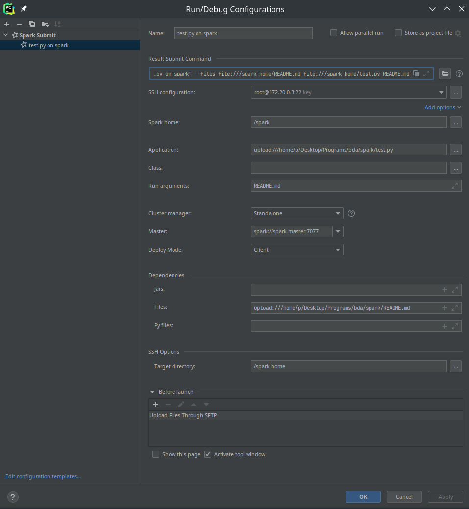

# Spark with docker and intellij IDEs

Docker container and setup instructions to run spark jobs in docker with intellij IDEs 

# Setting up docker
```shell
git clone git@github.com:pranavgade20/spark-docker-intellij.git
# replace YOUR_KEY_HERE in the Dockerfile with your ssh publickey
docker build --tag spark-ssh .
docker-compose up -d
```
This will build the docker image and start spark. At this point, you can ssh into the container(`ssh root@IP`) and run stuff with:
```shell
python3  /spark/bin/spark-submit \
            --master ${SPARK_MASTER_URL} \
            ${SPARK_SUBMIT_ARGS} \
            ${SPARK_APPLICATION_PYTHON_LOCATION} ${SPARK_APPLICATION_ARGS}
```

To set up intellij, install the Big Data Tools Extension(published by jetbrains), and create a new configuration as follows(where the ssh IP can be obtained by doing `docker network inspect spark-default` and looking for the IP corresponding to the container spark-default):



To use numpy/pandas on your server, you need to install the following toolchain:
```shell
docker exec -it spark-ssh apk add make automake gcc g++ subversion python3-dev
```